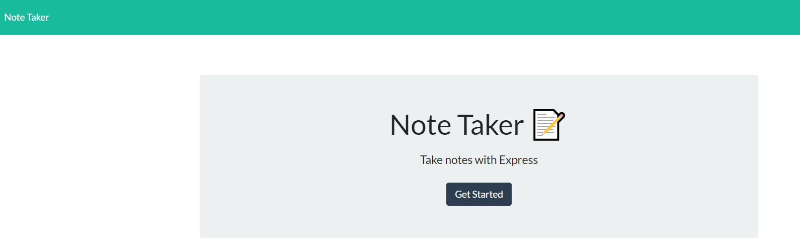
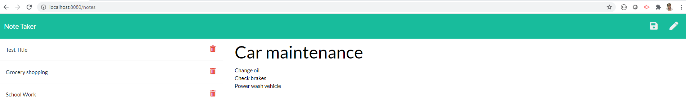

# Note Taker

 

> AS A user, I want to be able to write and save notes
  I WANT to be able to delete notes I've written before
  SO THAT I can organize my thoughts and keep track of tasks I need to complete

---

### Table of Contents

- [Description](#description)
- [Technologies](#technologies)
- [How To Use](#how-to-use)
- [License](#license)
- [Author Info](#author-info)

---

## Description

For users that need to keep track of a lot of information, it's easy to forget or be unable to recall something important. Being able to take persistent notes allows users to have written information available when needed.

### Technologies

- JavaScript
- Node.js
- HTML
- CSS

## How to Use

Open server.js file, start terminal and npm install dependencies. Port is listening at http://localhost:8080/. Type in your Note Title and Note Text, the information can be saved or deleted.

### License

Distributed under the MIT License. See LICENSE for more information.

[Back To The Top](#note-taker)

---

## Author Info

Fatim Robbins
fmsis@hotmail.com
Github link - https://melodie15.github.io/fatimrobbins.notetaker.github.io/
